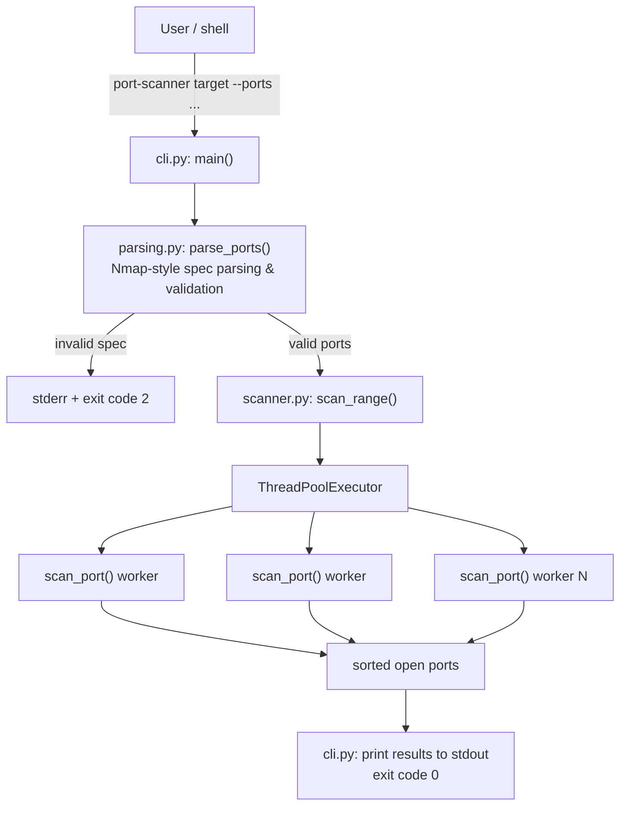

# ARCHITECTURE.md

## Overview

`port-scanner` is a layered application with no third-party runtime
dependencies:

- **Interface layer** — `src/port_scanner/cli.py`: argument parsing
  (`argparse`), output formatting, process exit codes. It calls into the
  shared logic layer below and contains no scanning or port-spec logic of
  its own.
- **Shared logic layer** — two independent modules, neither of which
  depends on the other or on any interface:
  - `src/port_scanner/scanner.py` — the scan engine (`scan_port`,
    `scan_range`).
  - `src/port_scanner/parsing.py` — Nmap-style port-spec parsing
    (`parse_ports`, `_to_port`).

Any interface (`cli.py` today; `web/` as of Milestone 2 — see
[`ROADMAP.md`](ROADMAP.md)) depends downward on `scanner.py` and
`parsing.py`. Interfaces never depend on each other.

## Diagram



## Layers, in detail

### `scanner.py` — scan engine

- `scan_port(host, port, timeout) -> bool`: opens one `socket.AF_INET,
  socket.SOCK_STREAM`, calls `connect_ex`, returns whether it succeeded.
  Fully self-contained — opens and closes its own socket, touches no
  shared state.
- `scan_range(host, ports, timeout, max_workers) -> list[int]`: fans
  `scan_port` out across a `ThreadPoolExecutor`, then returns the open
  ports sorted ascending.

### `parsing.py` — port-spec parsing

- `parse_ports(spec) -> list[int]` / `_to_port`: turns an Nmap-style string
  (`"22,80,443,8000-8010"`) into a validated, deduplicated, sorted list of
  port numbers, raising `ValueError` with a specific message on malformed
  input. Pure string-to-data logic — no knowledge of `argparse`, console
  output, or process exit codes, so any interface can reuse it unchanged.

### `cli.py` — interface

- Imports `parse_ports` from `parsing.py` and `scan_range` from
  `scanner.py`.
- `build_parser()`: defines the `argparse` CLI surface (`target`, `--ports`,
  `--timeout`, `--workers`).
- `main(argv=None) -> int`: wires parsing → `scan_range` → stdout output →
  exit code. This is the function exposed as the `port-scanner` console
  script entry point (`pyproject.toml`: `port-scanner = "port_scanner.cli:main"`).

### `web/` — FastAPI interface

A second interface, peer to `cli.py`, structured as a small package rather
than a single module:

```
src/port_scanner/web/
├── app.py               # create_app() factory; module-level `app` for uvicorn
├── core/
│   ├── config.py         # Settings, sourced from PORT_SCANNER_* env vars
│   ├── logging.py         # configure_logging() — one format/handler process-wide
│   ├── exceptions.py       # AppError + global exception handlers
│   └── templating.py        # shared Jinja2Templates instance
├── api/v1/
│   └── router.py           # api_router, mounted at settings.api_v1_prefix (empty scaffold)
├── routes/
│   ├── health.py            # GET /health — outside /api/v1
│   └── pages.py               # GET / and POST /scan — the server-rendered UI
├── services/
│   └── scan_service.py         # run_scan(): the only place web/ calls scanner.py/parsing.py
├── schemas/
│   ├── health.py                # HealthResponse
│   └── scan.py                    # ScanFormData, ScanResultView
├── templates/
│   ├── base.html                   # shared layout (header/nav/footer, links style.css)
│   ├── scan.html                    # the <form> — a partial included by index.html and results.html
│   ├── index.html                    # GET / — extends base, includes scan.html
│   └── results.html                   # POST /scan success — extends base, includes scan.html + a results table
└── static/css/style.css                # hand-written CSS, no framework, no JS
```

Design points:

- **Application factory, not a bare module-level app.** `create_app()`
  accepts an optional `Settings` override so tests build an app against a
  specific configuration without mutating process environment variables.
  `app.py` still exposes a module-level `app = create_app()` so
  `uvicorn port_scanner.web.app:app` works unchanged.
- **`/health` and the UI pages sit outside `/api/v1`.** Load balancers
  probe `/health` on a fixed path; `GET /`/`POST /scan` are the UI, not a
  JSON API contract — neither should move when the business API version
  bumps. Versioned endpoints mount under `settings.api_v1_prefix` via
  `api/v1/router.py`, which is intentionally still empty — a future JSON
  API for the same scan capability would live there, without touching the
  UI routes.
- **Global exception handling has two tiers**, for the JSON side of the
  app. An `AppError` base class (for future domain errors — auth
  failures, scan-job errors, etc. — to declare their own
  `status_code`/`detail`) and a catch-all `Exception` handler that logs
  the full traceback server-side and returns an opaque 500, so a bug
  never leaks internals to a client. FastAPI's own defaults for
  `HTTPException` and `RequestValidationError` are left untouched. The
  scan form has its *own*, separate error path (below) because its
  errors need to render as HTML, not JSON.
- **Configuration has no third-party dependency.** `core/config.py` is a
  plain `dataclass` reading `PORT_SCANNER_*` environment variables — no
  `pydantic-settings`. This follows the same reasoning as decision 5 in
  [`DECISIONS.md`](DECISIONS.md): don't add a dependency a feature doesn't
  actually need yet.
- **`services/scan_service.py` is the only bridge to the scanning core.**
  `routes/pages.py` never imports `parse_ports`/`scan_range` directly —
  it calls `run_scan(form)`, which does. This keeps the interface layer
  thin (HTTP concerns only: form parsing, template selection, status
  codes) and keeps the "interfaces never duplicate business logic" rule
  from [Decision 11](DECISIONS.md) enforceable by inspection: if a second
  web route ever needs to run a scan, it calls `run_scan` too, instead of
  re-deriving the call to `scan_range`.
- **Scan-form errors render as HTML, not JSON.** `run_scan` raises
  `ScanFormError` (a `ValueError` subclass) for anything the user can fix
  — a bad port spec, an out-of-range timeout, an unresolvable target.
  `routes/pages.py` catches it locally and re-renders `index.html` with
  the message inline and the submitted values still filled in (a "sticky"
  form) — it does *not* go through the JSON `AppError`/global-exception
  path above, which exists for a future JSON API, not for a page a human
  is looking at. Genuine bugs (not `ScanFormError`) still fall through to
  the global `Exception` handler.
- **The scan form has bounds the CLI doesn't.** `scan_service.py` caps
  ports-per-scan, timeout, and worker count — see
  [Decision 16](DECISIONS.md). The CLI has no such caps because argv is
  typed by whoever runs it locally; this form is reachable by anyone who
  can reach the server.
- **`scan.html` is a partial, not a page.** It contains only the `<form>`
  and is ``d by both `index.html` (empty/sticky form) and
  `results.html` (sticky form + a results table below it), so the field
  markup exists exactly once.
- **Synchronous route handlers, not `async def`.** `scan_range` blocks the
  calling thread until every port in the batch has been probed. Starlette
  runs a plain `def` route in a worker thread automatically
  (`run_in_threadpool`); had `submit_scan` been `async def` and called
  `run_scan` directly, a single in-flight scan would block the entire
  event loop — every other request the server is handling — for the
  scan's duration.

## Why business logic is separated from the interface

1. **Testability.** `scanner.py` and `parsing.py` can each be tested in
   isolation (`tests/test_scanner.py`, `tests/test_cli.py`) without going
   through `argparse` or capturing stdout. `cli.py` is tested separately for
   its own parsing wiring and exit-code behavior.
2. **Reusability.** Nothing in `scanner.py` or `parsing.py` assumes it's
   being driven from a terminal. The same functions now also back the web
   interface (`web/services/scan_service.py` calls both, unchanged) — see
   [`ROADMAP.md`](ROADMAP.md).
3. **Safety of the concurrency model.** Because `scan_port` is pure with
   respect to shared state (it owns only its own socket), `scan_range` can
   run it across a thread pool with zero locking. Mixing in CLI/I/O concerns
   at that layer would risk introducing shared state (e.g. a shared output
   buffer) that isn't thread-safe.
4. **Clear failure boundaries.** Input validation (`parse_ports`) happens
   entirely before any network I/O in the scan engine begins — invalid
   input never reaches `scan_range`.
5. **Interfaces are peers, not dependents of each other.** `parse_ports`
   originally lived in `cli.py`. Left there, any future interface would
   have had to either import from another *interface* module or duplicate
   the parsing logic. Extracting it to `parsing.py` means every interface
   depends only on shared logic modules — never on another interface.
