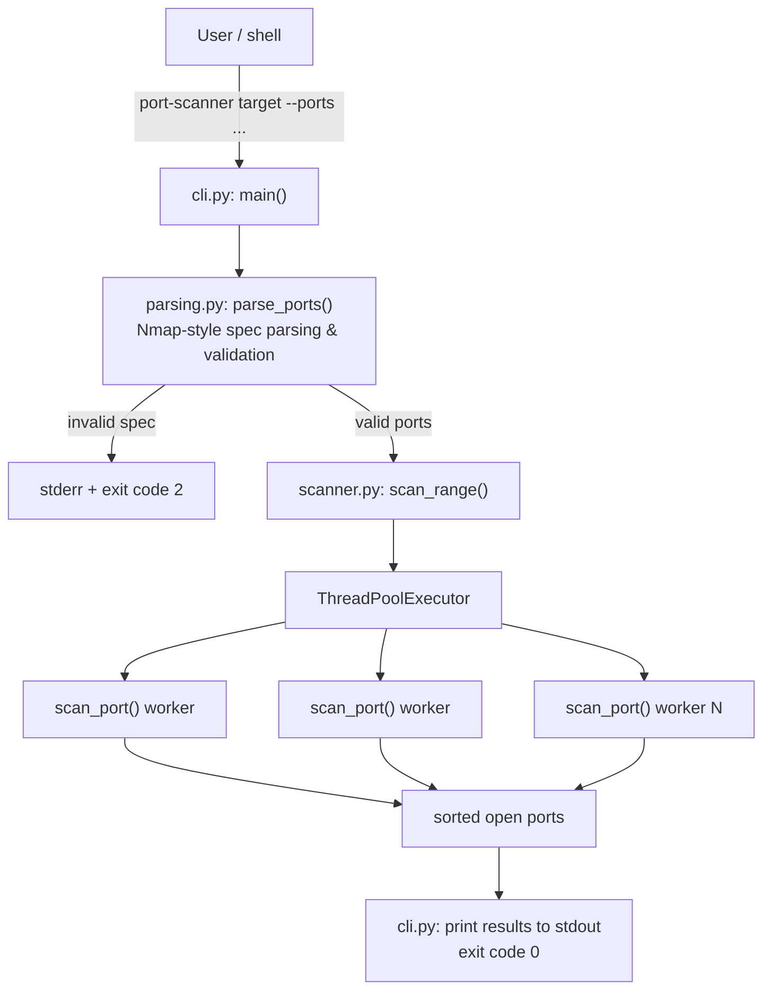

# ARCHITECTURE.md

## Overview

`port-scanner` is a layered application with no third-party runtime
dependencies:

- **Interface layer** — `src/port_scanner/cli.py`: argument parsing
  (`argparse`), output formatting, process exit codes. It calls into the
  shared logic layer below and contains no scanning or port-spec logic of
  its own.
- **Shared logic layer** — two independent modules, neither of which
  depends on the other or on any interface:
  - `src/port_scanner/scanner.py` — the scan engine (`scan_port`,
    `scan_range`).
  - `src/port_scanner/parsing.py` — Nmap-style port-spec parsing
    (`parse_ports`, `_to_port`).

Any interface (`cli.py` today; `web/` as of Milestone 1 — see
[`ROADMAP.md`](ROADMAP.md)) depends downward on `scanner.py` and
`parsing.py`. Interfaces never depend on each other.

## Diagram



## Layers, in detail

### `scanner.py` — scan engine

- `scan_port(host, port, timeout) -> bool`: opens one `socket.AF_INET,
  socket.SOCK_STREAM`, calls `connect_ex`, returns whether it succeeded.
  Fully self-contained — opens and closes its own socket, touches no
  shared state.
- `scan_range(host, ports, timeout, max_workers) -> list[int]`: fans
  `scan_port` out across a `ThreadPoolExecutor`, then returns the open
  ports sorted ascending.

### `parsing.py` — port-spec parsing

- `parse_ports(spec) -> list[int]` / `_to_port`: turns an Nmap-style string
  (`"22,80,443,8000-8010"`) into a validated, deduplicated, sorted list of
  port numbers, raising `ValueError` with a specific message on malformed
  input. Pure string-to-data logic — no knowledge of `argparse`, console
  output, or process exit codes, so any interface can reuse it unchanged.

### `cli.py` — interface

- Imports `parse_ports` from `parsing.py` and `scan_range` from
  `scanner.py`.
- `build_parser()`: defines the `argparse` CLI surface (`target`, `--ports`,
  `--timeout`, `--workers`).
- `main(argv=None) -> int`: wires parsing → `scan_range` → stdout output →
  exit code. This is the function exposed as the `port-scanner` console
  script entry point (`pyproject.toml`: `port-scanner = "port_scanner.cli:main"`).

### `web/` — FastAPI interface (skeleton as of Milestone 1)

A second interface, peer to `cli.py`, structured as a small package rather
than a single module:

```
src/port_scanner/web/
├── app.py              # create_app() factory; module-level `app` for uvicorn
├── core/
│   ├── config.py        # Settings, sourced from PORT_SCANNER_* env vars
│   ├── logging.py        # configure_logging() — one format/handler process-wide
│   └── exceptions.py      # AppError + global exception handlers
├── api/v1/
│   └── router.py          # api_router, mounted at settings.api_v1_prefix
├── routes/
│   └── health.py           # GET /health — deliberately outside /api/v1
└── schemas/
    └── health.py            # HealthResponse
```

Design points:

- **Application factory, not a bare module-level app.** `create_app()`
  accepts an optional `Settings` override so tests build an app against a
  specific configuration without mutating process environment variables.
  `app.py` still exposes a module-level `app = create_app()` so
  `uvicorn port_scanner.web.app:app` works unchanged.
- **`/health` sits outside `/api/v1`.** Load balancers and orchestrators
  probe it on a fixed path; its contract shouldn't move when the business
  API version bumps. Versioned endpoints mount under `settings.api_v1_prefix`
  via `api/v1/router.py`, which is intentionally empty until an endpoint is
  added — the versioning scaffold exists so wiring `app.py` never needs to
  change again once endpoints (e.g. the scan endpoint) land in Milestone 2.
- **Global exception handling has two tiers.** An `AppError` base class
  (for future domain errors — auth failures, scan-job errors, etc. — to
  declare their own `status_code`/`detail`) and a catch-all `Exception`
  handler that logs the full traceback server-side and returns an opaque
  500, so a bug never leaks internals to a client. FastAPI's own defaults
  for `HTTPException` and `RequestValidationError` are left untouched.
- **Configuration has no third-party dependency.** `core/config.py` is a
  plain `dataclass` reading `PORT_SCANNER_*` environment variables — no
  `pydantic-settings`. This follows the same reasoning as decision 5 in
  [`DECISIONS.md`](DECISIONS.md): don't add a dependency a feature doesn't
  actually need yet.
- **No scan logic wired in.** As of Milestone 1, `web/` does not import
  `scanner.py` or call `parse_ports`/`scan_range` anywhere — only the
  skeleton (config, logging, exceptions, versioning, `/health`, customized
  OpenAPI docs) exists. The scan-facing routes (`GET /`, `POST /scan`,
  `templates/`, `static/`) are a later milestone.

## Why business logic is separated from the interface

1. **Testability.** `scanner.py` and `parsing.py` can each be tested in
   isolation (`tests/test_scanner.py`, `tests/test_cli.py`) without going
   through `argparse` or capturing stdout. `cli.py` is tested separately for
   its own parsing wiring and exit-code behavior.
2. **Reusability.** Nothing in `scanner.py` or `parsing.py` assumes it's
   being driven from a terminal. The same functions could back a different
   interface — e.g. the web interface listed as a planned item in
   [`ROADMAP.md`](ROADMAP.md) — without any change to either module.
3. **Safety of the concurrency model.** Because `scan_port` is pure with
   respect to shared state (it owns only its own socket), `scan_range` can
   run it across a thread pool with zero locking. Mixing in CLI/I/O concerns
   at that layer would risk introducing shared state (e.g. a shared output
   buffer) that isn't thread-safe.
4. **Clear failure boundaries.** Input validation (`parse_ports`) happens
   entirely before any network I/O in the scan engine begins — invalid
   input never reaches `scan_range`.
5. **Interfaces are peers, not dependents of each other.** `parse_ports`
   originally lived in `cli.py`. Left there, any future interface would
   have had to either import from another *interface* module or duplicate
   the parsing logic. Extracting it to `parsing.py` means every interface
   depends only on shared logic modules — never on another interface.
