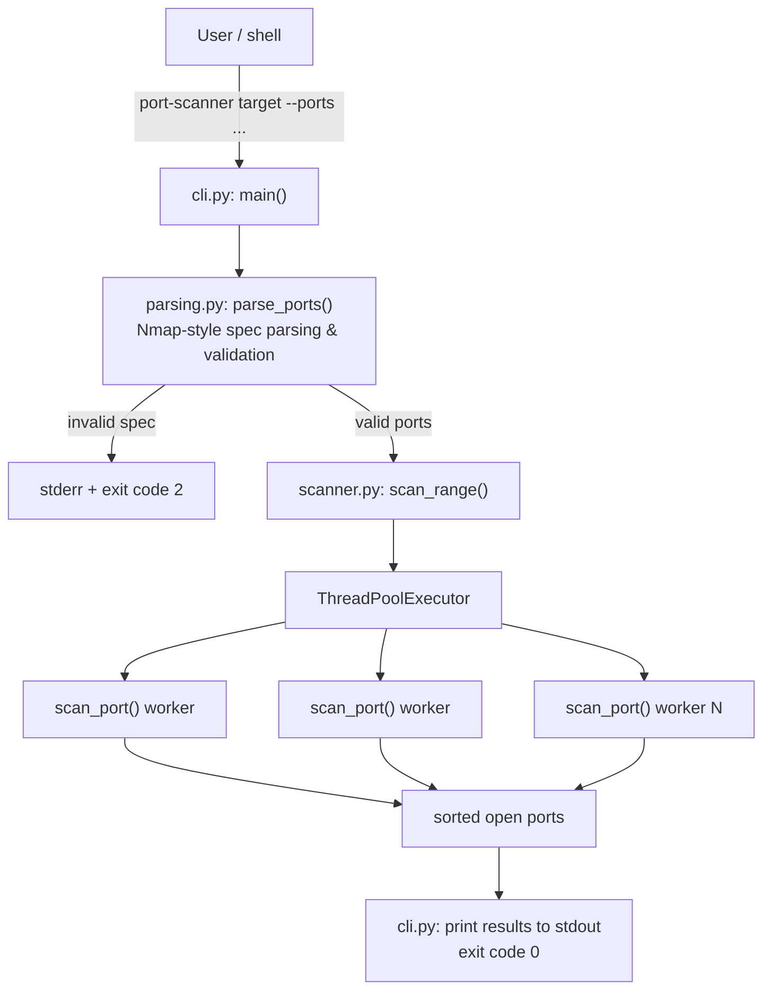

# ARCHITECTURE.md

## Overview

`port-scanner` is a layered application with no third-party runtime
dependencies:

- **Interface layer** — `src/port_scanner/cli.py`: argument parsing
  (`argparse`), output formatting, process exit codes. It calls into the
  shared logic layer below and contains no scanning or port-spec logic of
  its own.
- **Shared logic layer** — two independent modules, neither of which
  depends on the other or on any interface:
  - `src/port_scanner/scanner.py` — the scan engine (`scan_port`,
    `scan_range`).
  - `src/port_scanner/parsing.py` — Nmap-style port-spec parsing
    (`parse_ports`, `_to_port`).

Any interface (`cli.py` today; a planned web interface — see
[`ROADMAP.md`](ROADMAP.md) — later) depends downward on `scanner.py` and
`parsing.py`. Interfaces never depend on each other.

## Diagram

## Layers, in detail

### `scanner.py` — scan engine

- `scan_port(host, port, timeout) -> bool`: opens one `socket.AF_INET,
  socket.SOCK_STREAM`, calls `connect_ex`, returns whether it succeeded.
  Fully self-contained — opens and closes its own socket, touches no
  shared state.
- `scan_range(host, ports, timeout, max_workers) -> list[int]`: fans
  `scan_port` out across a `ThreadPoolExecutor`, then returns the open
  ports sorted ascending.

### `parsing.py` — port-spec parsing

- `parse_ports(spec) -> list[int]` / `_to_port`: turns an Nmap-style string
  (`"22,80,443,8000-8010"`) into a validated, deduplicated, sorted list of
  port numbers, raising `ValueError` with a specific message on malformed
  input. Pure string-to-data logic — no knowledge of `argparse`, console
  output, or process exit codes, so any interface can reuse it unchanged.

### `cli.py` — interface

- Imports `parse_ports` from `parsing.py` and `scan_range` from
  `scanner.py`.
- `build_parser()`: defines the `argparse` CLI surface (`target`, `--ports`,
  `--timeout`, `--workers`).
- `main(argv=None) -> int`: wires parsing → `scan_range` → stdout output →
  exit code. This is the function exposed as the `port-scanner` console
  script entry point (`pyproject.toml`: `port-scanner = "port_scanner.cli:main"`).

## Why business logic is separated from the interface

1. **Testability.** `scanner.py` and `parsing.py` can each be tested in
   isolation (`tests/test_scanner.py`, `tests/test_cli.py`) without going
   through `argparse` or capturing stdout. `cli.py` is tested separately for
   its own parsing wiring and exit-code behavior.
2. **Reusability.** Nothing in `scanner.py` or `parsing.py` assumes it's
   being driven from a terminal. The same functions could back a different
   interface — e.g. the web interface listed as a planned item in
   [`ROADMAP.md`](ROADMAP.md) — without any change to either module.
3. **Safety of the concurrency model.** Because `scan_port` is pure with
   respect to shared state (it owns only its own socket), `scan_range` can
   run it across a thread pool with zero locking. Mixing in CLI/I/O concerns
   at that layer would risk introducing shared state (e.g. a shared output
   buffer) that isn't thread-safe.
4. **Clear failure boundaries.** Input validation (`parse_ports`) happens
   entirely before any network I/O in the scan engine begins — invalid
   input never reaches `scan_range`.
5. **Interfaces are peers, not dependents of each other.** `parse_ports`
   originally lived in `cli.py`. Left there, any future interface would
   have had to either import from another *interface* module or duplicate
   the parsing logic. Extracting it to `parsing.py` means every interface
   depends only on shared logic modules — never on another interface.
