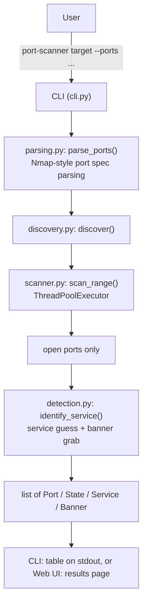

# Port Scanner

[](https://github.com/MahmoudElrefaie-Eng/python-port-scanner/actions/workflows/ci.yml)
[](LICENSE)
[](.github/workflows/ci.yml)

A fast, concurrent TCP port scanner built in Python, developed as part of a
cybersecurity portfolio — evolving into a lightweight network discovery
platform that reports not just which ports are open, but what's running on
them. It scans a host over Nmap-style port specs using a thread pool,
identifies common services and grabs their banners (no Nmap, no external
APIs, no vulnerability scanning), and ships as both an installable CLI
(`port-scanner`) and a server-rendered web UI, with a full automated test
suite and CI.

## Table of Contents

- [Project Status](#project-status)
- [Features](#features)
- [Architecture](#architecture)
- [Installation](#installation)
- [Usage](#usage)
- [CLI Examples](#cli-examples)
- [Web Interface](#web-interface)
- [Project Structure](#project-structure)
- [Testing](#testing)
- [Continuous Integration](#continuous-integration)
- [Roadmap](#roadmap)
- [Documentation](#documentation)
- [Disclaimer](#disclaimer)
- [License](#license)

## Project Status

- ✅ Stable CLI release
- ✅ Automated testing with GitHub Actions
- ✅ Web interface: server-rendered scan form (`GET /`, `POST /scan`) — see below
- ✅ Service detection & banner grabbing — shared by the CLI and the web UI, see below
- ✅ Vulnerability matching & risk scoring engine (`security/`) — built and
  tested, **not yet reachable from the CLI or web UI** (Milestone 5)
- 🚧 Planned features:
  - Wiring the vulnerability-assessment engine into the CLI and web UI
  - Additional vulnerability providers (OSV, Vulners)
  - JSON / file export output formats
  - Banner grabbing for the remaining services that currently only get a
    port-based guess (DNS, LDAP, SMB, RDP, PostgreSQL, MongoDB, NTP)
  - Web interface: authentication, scan history, user accounts (deferred
    in favor of this direction — see [`DECISIONS.md`](DECISIONS.md#26-roadmap-pivot-service-detection-before-authenticationaccountshistory))

## Features

- **TCP connect scanning** — reliable, works without elevated privileges
  (no raw sockets required).
- **Concurrent scanning** — a `ThreadPoolExecutor` scans many ports in
  parallel instead of one at a time, so scanning 1,000 ports takes roughly
  as long as the slowest single connection, not the sum of all of them.
- **Nmap-style port specs** — `22,80,443,8000-8010` style input, with
  validation and clear error messages for malformed specs.
- **Service detection** — identifies 16 common services (SSH, HTTP, HTTPS,
  FTP, SMTP, POP3, IMAP, DNS, MySQL, PostgreSQL, Redis, MongoDB, SMB,
  LDAP, RDP, NTP) on open ports from a well-known-port table.
- **Banner grabbing** — for 9 of those services (SSH, FTP, SMTP, POP3,
  IMAP, HTTP, HTTPS, MySQL, Redis), reads or requests a real banner
  (`OpenSSH_9.6`, `nginx/1.18.0`, a MySQL version string, ...) instead of
  just guessing from the port — no Nmap, lightweight protocol-aware
  probes only. A banner grab failing never fails the scan; it falls back
  to `Unknown`.
- **Vulnerability matching & risk scoring** (`src/port_scanner/security/`)
  — matches a detected service's version against known CVEs (a local
  SQLite cache checked first, the live NVD database on a cache miss),
  scores risk from CVSS (worst-case per host), and generates a
  deterministic remediation suggestion. Built around a
  `VulnerabilityProvider` protocol so more sources (OSV, Vulners, ...)
  are additive, not a rewrite. **Not yet wired into the CLI or web UI.**
- **Configurable timeout and concurrency** — tune `--timeout` and
  `--workers` per scan for speed vs. reliability trade-offs.
- **Scriptable exit codes** — `0` for a completed scan, `2` for invalid
  input — safe to use in shell pipelines and automation.
- **Fully tested** — 137 tests covering the scan engine, port-spec parser,
  service detection, banner grabbing, vulnerability matching/risk
  scoring, CLI, and web interface, run automatically on every push via
  GitHub Actions.

## Architecture



Each `scan_port()` call opens its own socket and shares no state with the
others, so the thread pool needs no locking — this is what keeps the
concurrency model simple. Banner grabbing runs as a second pass, only
against ports the first pass found open, so it doesn't meaningfully slow
down a full-range scan. See [`ARCHITECTURE.md`](ARCHITECTURE.md) for the
full design and [`DECISIONS.md`](DECISIONS.md) for the reasoning.

## Installation

Requires Python 3.10+.

```bash
python3 -m venv .venv
source .venv/bin/activate
pip install -e ".[dev]"
```

The web interface (see [Web Interface](#web-interface)) is an optional
extra — the base install above stays dependency-free:

```bash
pip install -e ".[dev,web]"
```

## Usage

```bash
port-scanner 127.0.0.1 --ports 22,80,443,8000-8010
port-scanner example.com --ports 1-1024 --timeout 0.5 --workers 100
```

Example output:

```
Open ports on 127.0.0.1:

PORT  STATE  SERVICE  BANNER
----  -----  -------  ----------------------------------
22    OPEN   SSH      OpenSSH_9.6
8000  OPEN   HTTP     nginx/1.18.0
```

If no ports in the scanned range are open:

```
No open ports found on 127.0.0.1 in the scanned range.
```

## CLI Examples

Scan well-known ports with defaults (ports `1-1024`, 1s timeout, 50 workers):

```bash
port-scanner 127.0.0.1
```

Scan a specific list and range together:

```bash
port-scanner 192.168.1.1 --ports 22,80,443,8000-8010
```

Scan faster with more workers and a shorter timeout (useful on responsive
local networks):

```bash
port-scanner 10.0.0.5 --ports 1-65535 --timeout 0.3 --workers 200
```

Invalid port specs fail fast with exit code `2` instead of scanning:

```bash
$ port-scanner 127.0.0.1 --ports abc
error: invalid port 'abc' in spec: 'abc'
```

A successful scan (open ports found or not) exits with status code `0`.

## Web Interface

A FastAPI web interface lives at `src/port_scanner/web/`, as a peer to the
CLI — it depends only on `discovery.py`/`parsing.py`, never on `cli.py`.
Server-rendered with Jinja2 (no JavaScript): a scan form (`GET /`) posts to
`POST /scan`, which runs the same `discover()` pipeline the CLI uses —
scan, then service detection and banner grabbing — and renders a results
table with Port/Status/Service/Banner columns. Invalid input (a bad port
spec, an empty target, an out-of-range timeout, an unresolvable host) is
shown inline on the page, never as a raw exception. Also included:
environment-variable configuration, centralized logging, global exception
handling for the `/api/v1` side, and customized OpenAPI docs. No
authentication, database, or async job queue yet.

```bash
pip install -e ".[dev,web]"
uvicorn port_scanner.web.app:app --reload
```

Then open `http://127.0.0.1:8000/` in a browser.

- `GET /` — the scan form
- `POST /scan` — runs a scan (with service detection), renders the results page
- `GET /health` — liveness check
- `GET /docs`, `GET /redoc` — interactive API documentation
- `GET /openapi.json` — OpenAPI schema

See [`ARCHITECTURE.md`](ARCHITECTURE.md) for the design and
[`ROADMAP.md`](ROADMAP.md) for what's planned next (auth, scan history,
user accounts — deferred, not abandoned).

## Project Structure

```
python-port-scanner/
├── .github/workflows/  # CI workflow (GitHub Actions)
│   └── ci.yml
├── src/port_scanner/   # installable package source
│   ├── scanner.py      # scan_port / scan_range (TCP connect scan engine)
│   ├── parsing.py      # parse_ports (Nmap-style port-spec parsing)
│   ├── detection.py    # guess_service / identify_service (service ID + banners)
│   ├── discovery.py    # discover() — the shared entrypoint (scan + detect)
│   ├── security/       # assess() — vulnerability matching + risk scoring
│   │   ├── models.py       # Host -> Service -> Finding -> Vulnerability
│   │   ├── matching.py      # banner -> (product, version)
│   │   ├── risk.py           # CVSS -> RiskLevel, recommendations
│   │   ├── cve_db.py          # local SQLite CVE cache
│   │   ├── engine.py           # assess() — not yet called by cli.py/web/
│   │   └── providers/           # LocalCVEProvider, NVDProvider (+ Protocol)
│   ├── cli.py          # command-line interface (table output)
│   └── web/            # FastAPI interface (see Web Interface, above)
│       ├── app.py          # create_app() factory
│       ├── core/            # config, logging, exceptions, templating
│       ├── api/v1/           # versioned API router (empty scaffold)
│       ├── routes/            # health.py, pages.py (GET /, POST /scan)
│       ├── services/           # scan_service.py — the only caller of
│       │                          scanner.py/parsing.py from web/
│       ├── schemas/             # Pydantic models
│       ├── templates/            # Jinja2: base/index/scan/results.html
│       └── static/css/            # style.css
├── tests/              # test suite
├── pyproject.toml      # packaging & dependencies
├── README.md
├── .gitignore
└── LICENSE
```

## Testing

Run the test suite locally:

```bash
pytest
```

## Continuous Integration

Every push and pull request runs the full test suite on `ubuntu-latest`
with Python 3.14 via GitHub Actions, installing the project the same way a
developer would locally (`pip install -e ".[dev,web]"`). See
[`.github/workflows/ci.yml`](.github/workflows/ci.yml).

## Roadmap

- [x] Project scaffolding, Git, README, licensing
- [x] Core TCP connect scanning engine
- [x] Concurrency (threaded scanning for speed)
- [x] CLI interface (argument parsing, target/port range input)
- [x] Packaging (`pyproject.toml`, installable console script)
- [x] Test suite
- [x] CI (automated tests on every push)
- [x] Service/banner detection (16 services identified; 9 with active
      banner grabs — see [`DECISIONS.md`](DECISIONS.md))
- [x] Output formats: table (CLI + web); JSON/file export still planned
- [x] Web interface — Milestone 1: FastAPI skeleton
- [x] Web interface — Milestone 2: scan flow
- [x] Web interface — Milestone 3: service detection & banner grabbing
- [ ] Web interface — auth, scan history, user accounts (deferred)
- [ ] Deployment
- [x] Security assessment engine (`security/`) — vulnerability matching,
      risk scoring, multi-provider abstraction (Local + NVD working; OSV/
      Vulners designed for, not yet built)
- [ ] Security assessment — wired into the CLI and web UI (Milestone 5)

## Documentation

Further project documentation lives at the repository root:

- [`PROJECT_CONTEXT.md`](PROJECT_CONTEXT.md) — current status and next objective
- [`ARCHITECTURE.md`](ARCHITECTURE.md) — code structure and design rationale
- [`ROADMAP.md`](ROADMAP.md) — detailed, phased roadmap
- [`DECISIONS.md`](DECISIONS.md) — architectural decisions and rationale

## Disclaimer

This tool is intended for authorized security testing and educational use only (e.g., scanning systems you own or have explicit permission to test). Unauthorized port scanning of systems you do not own or have permission to test may be illegal in your jurisdiction.

## License

MIT — see [LICENSE](LICENSE).
