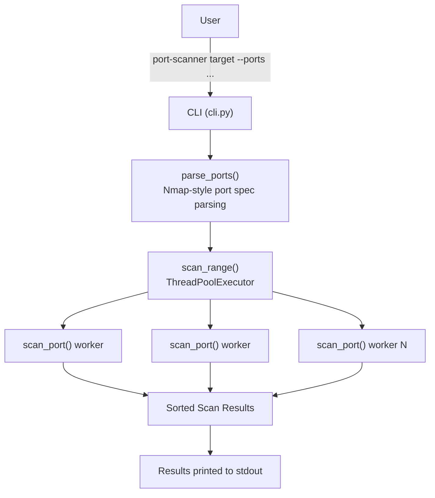

# Port Scanner

[](https://github.com/MahmoudElrefaie-Eng/python-port-scanner/actions/workflows/ci.yml)
[](LICENSE)
[](.github/workflows/ci.yml)

A fast, concurrent TCP port scanner built in Python, developed as part of a
cybersecurity portfolio. It scans a host over Nmap-style port specs using a
thread pool and ships as an installable CLI (`port-scanner`) with a full
automated test suite and CI.

## Table of Contents

- [Project Status](#project-status)
- [Features](#features)
- [Architecture](#architecture)
- [Installation](#installation)
- [Usage](#usage)
- [CLI Examples](#cli-examples)
- [Project Structure](#project-structure)
- [Testing](#testing)
- [Continuous Integration](#continuous-integration)
- [Roadmap](#roadmap)
- [Disclaimer](#disclaimer)
- [License](#license)

## Project Status

- ✅ Stable CLI release
- ✅ Automated testing with GitHub Actions
- 🚧 Planned features:
  - Service/banner detection
  - JSON export
  - Web interface

## Features

- **TCP connect scanning** — reliable, works without elevated privileges
  (no raw sockets required).
- **Concurrent scanning** — a `ThreadPoolExecutor` scans many ports in
  parallel instead of one at a time, so scanning 1,000 ports takes roughly
  as long as the slowest single connection, not the sum of all of them.
- **Nmap-style port specs** — `22,80,443,8000-8010` style input, with
  validation and clear error messages for malformed specs.
- **Configurable timeout and concurrency** — tune `--timeout` and
  `--workers` per scan for speed vs. reliability trade-offs.
- **Scriptable exit codes** — `0` for a completed scan, `2` for invalid
  input — safe to use in shell pipelines and automation.
- **Fully tested** — unit tests for the scan engine, port-spec parser, and
  CLI, run automatically on every push via GitHub Actions.

## Architecture



Each `scan_port()` call opens its own socket and shares no state with the
others, so the thread pool needs no locking — this is what keeps the
concurrency model simple.

## Installation

Requires Python 3.10+.

```bash
python3 -m venv .venv
source .venv/bin/activate
pip install -e ".[dev]"
```

## Usage

```bash
port-scanner 127.0.0.1 --ports 22,80,443,8000-8010
port-scanner example.com --ports 1-1024 --timeout 0.5 --workers 100
```

Example output:

```
Open ports on 127.0.0.1:
  8000/tcp open
```

If no ports in the scanned range are open:

```
No open ports found on 127.0.0.1 in the scanned range.
```

## CLI Examples

Scan well-known ports with defaults (ports `1-1024`, 1s timeout, 50 workers):

```bash
port-scanner 127.0.0.1
```

Scan a specific list and range together:

```bash
port-scanner 192.168.1.1 --ports 22,80,443,8000-8010
```

Scan faster with more workers and a shorter timeout (useful on responsive
local networks):

```bash
port-scanner 10.0.0.5 --ports 1-65535 --timeout 0.3 --workers 200
```

Invalid port specs fail fast with exit code `2` instead of scanning:

```bash
$ port-scanner 127.0.0.1 --ports abc
error: invalid port 'abc' in spec: 'abc'
```

A successful scan (open ports found or not) exits with status code `0`.

## Project Structure

```
python-port-scanner/
├── .github/workflows/  # CI workflow (GitHub Actions)
│   └── ci.yml
├── src/port_scanner/   # installable package source
│   ├── scanner.py      # scan_port / scan_range (TCP connect scan engine)
│   └── cli.py          # command-line interface
├── tests/              # test suite
├── pyproject.toml      # packaging & dependencies
├── README.md
├── .gitignore
└── LICENSE
```

## Testing

Run the test suite locally:

```bash
pytest
```

## Continuous Integration

Every push and pull request runs the full test suite on `ubuntu-latest`
with Python 3.14 via GitHub Actions, installing the project the same way a
developer would locally (`pip install -e ".[dev]"`). See
[`.github/workflows/ci.yml`](.github/workflows/ci.yml).

## Roadmap

- [x] Project scaffolding, Git, README, licensing
- [x] Core TCP connect scanning engine
- [x] Concurrency (threaded scanning for speed)
- [x] CLI interface (argument parsing, target/port range input)
- [x] Packaging (`pyproject.toml`, installable console script)
- [x] Test suite
- [x] CI (automated tests on every push)
- [ ] Service/banner detection
- [ ] Output formats (JSON, table, file export)
- [ ] Web interface for interactive scanning
- [ ] Deployment

## Disclaimer

This tool is intended for authorized security testing and educational use only (e.g., scanning systems you own or have explicit permission to test). Unauthorized port scanning of systems you do not own or have permission to test may be illegal in your jurisdiction.

## License

MIT — see [LICENSE](LICENSE).
