# ROADMAP.md

Detailed roadmap for `01-port-scanner`. Checkbox state reflects what is
actually implemented in the codebase as of this writing, not intent.

```mermaid
flowchart LR
    subgraph P1["Phase 1 — Foundation (done)"]
        direction TB
        p1a["Scaffolding, Git, README, MIT license"]
        p1b["Core TCP connect-scan engine"]
        p1c["Concurrency (ThreadPoolExecutor)"]
        p1d["CLI (argparse, Nmap-style port specs)"]
        p1e["Packaging (pyproject.toml, console script)"]
        p1f["Test suite (pytest, real sockets)"]
        p1g["CI (GitHub Actions)"]
    end
    subgraph P2["Phase 2 — Richer output (planned)"]
        direction TB
        p2a["Service / banner detection"]
        p2b["Output formats: JSON / table / file export"]
    end
    subgraph P3["Phase 3 — Interfaces & delivery (planned)"]
        direction TB
        p3a["Web interface for interactive scanning"]
        p3b["Deployment"]
    end
    P1 --> P2 --> P3
```

## Phase 1 — Foundation (complete)

- [x] Project scaffolding, Git, README, licensing (MIT)
- [x] Core TCP connect-scan engine (`scan_port`)
- [x] Concurrency — threaded scanning via `ThreadPoolExecutor` (`scan_range`)
- [x] CLI interface — target/port-range input, `--timeout`, `--workers`
- [x] Packaging — `pyproject.toml`, installable `port-scanner` console script
- [x] Test suite — `tests/test_scanner.py`, `tests/test_cli.py`
- [x] CI — automated tests on every push/PR (`.github/workflows/ci.yml`)
- [x] v1.0.0 release (`pyproject.toml`)

## Phase 2 — Richer output (not started)

- [ ] Service/banner detection on open ports
- [ ] Output formats: JSON, table, file export

## Phase 3 — Interfaces & delivery (not started)

- [ ] Web interface for interactive scanning
- [ ] Deployment

None of the Phase 2 or Phase 3 items exist in `src/port_scanner/` today —
they are tracked here as intent only, matching the "planned" section of
`README.md`.
