# ROADMAP.md

Detailed roadmap for `01-port-scanner`. Checkbox state reflects what is
actually implemented in the codebase as of this writing, not intent.

## Direction

As of Milestone 3, this project deliberately evolved from a TCP port
scanner into a lightweight **network discovery platform**: reporting not
just which ports are open, but what's actually running on them — while
staying dependency-light and Nmap-free (see [Decision 21](DECISIONS.md)).
As of Milestone 4, the long-term goal is broader still: a professional
**Security Assessment Platform** — discovery plus vulnerability matching,
risk scoring, and (later) reporting, compliance, threat intelligence, and
AI-assisted analysis, all under `src/port_scanner/security/`
([Decision 27](DECISIONS.md)). Authentication, scan history, and user
accounts were the originally planned next step after the web scan flow
(Milestone 2) but have been explicitly deferred in favor of this
direction — see [Decision 26](DECISIONS.md). They remain planned, just
not next.

```mermaid
flowchart LR
    subgraph P1["Phase 1 — Foundation (done)"]
        direction TB
        p1a["Scaffolding, Git, README, MIT license"]
        p1b["Core TCP connect-scan engine"]
        p1c["Concurrency (ThreadPoolExecutor)"]
        p1d["CLI (argparse, Nmap-style port specs)"]
        p1e["Packaging (pyproject.toml, console script)"]
        p1f["Test suite (pytest, real sockets)"]
        p1g["CI (GitHub Actions)"]
    end
    subgraph P2["Phase 2 — Richer output (in progress)"]
        direction TB
        p2a["Service / banner detection (done)"]
        p2b["Output formats: JSON / file export (planned)"]
    end
    subgraph P3["Phase 3 — Interfaces & delivery (in progress)"]
        direction TB
        p3a1["Web interface: FastAPI skeleton (done)"]
        p3a2["Web interface: scan flow (done)"]
        p3a3["Web interface: service detection UI (done)"]
        p3a4["Web interface: auth / history / accounts (deferred, planned)"]
        p3b["Deployment"]
    end
    subgraph P4["Phase 4 — Security Assessment Platform (in progress)"]
        direction TB
        p4a["security/ engine: matching, risk scoring, Local+NVD providers (done)"]
        p4b["CLI + web wiring for assessment (planned, Milestone 5)"]
        p4c["OSV / Vulners providers (planned, additive)"]
        p4d["Asset inventory, reporting, compliance, threat intel, AI (planned)"]
    end
    P1 --> P2 --> P3 --> P4
```

## Phase 1 — Foundation (complete)

- [x] Project scaffolding, Git, README, licensing (MIT)
- [x] Core TCP connect-scan engine (`scan_port`)
- [x] Concurrency — threaded scanning via `ThreadPoolExecutor` (`scan_range`)
- [x] CLI interface — target/port-range input, `--timeout`, `--workers`
- [x] Packaging — `pyproject.toml`, installable `port-scanner` console script
- [x] Test suite — `tests/test_scanner.py`, `tests/test_cli.py`
- [x] CI — automated tests on every push/PR (`.github/workflows/ci.yml`)
- [x] v1.0.0 release (`pyproject.toml`)

## Phase 2 — Richer output (in progress)

- [x] Service/banner detection on open ports — Milestone 3 (see Phase 3
      below; implemented once, in `detection.py`/`discovery.py`, and
      consumed by both the CLI and the web UI). Port-based service
      identification for 16 services; active banner grabs for 9 of them
      (SSH, FTP, SMTP, POP3, IMAP, HTTP, HTTPS, MySQL, Redis) — see
      [Decision 22](DECISIONS.md) for which 7 don't yet have one and why.
      The CLI's table output also covers the "table" half of the item
      below.
- [ ] Output formats: JSON, file export (terminal table done; JSON and
      file export not started)

## Phase 3 — Interfaces & delivery (in progress)

- [x] Web interface — Milestone 1: FastAPI skeleton (`src/port_scanner/web/`
      — app factory, env-var configuration, centralized logging, global
      exception handling, `/api/v1` versioning scaffold, `/health`,
      customized OpenAPI docs; `tests/test_web.py`). No scan logic wired in.
- [x] Web interface — Milestone 2: scan flow. `GET /` and `POST /scan`,
      server-rendered (Jinja2, no JS) via `web/routes/pages.py` and
      `web/services/scan_service.py`. `templates/` (`base.html`,
      `index.html`, `scan.html`, `results.html`) and `static/css/style.css`.
      Validation errors (bad port spec, empty target, out-of-range
      timeout/workers, unresolvable host) render inline in the page, not
      as raw exceptions.
- [x] Web interface — Milestone 3: service detection & banner grabbing.
      `src/port_scanner/detection.py` (service guessing, banner grabbing)
      and `src/port_scanner/discovery.py` (`discover()`, the single
      shared entrypoint both `cli.py` and `web/services/scan_service.py`
      call — see [Decision 20](DECISIONS.md)). CLI output upgraded to a
      hand-rolled table (`PORT`/`STATE`/`SERVICE`/`BANNER`, no new
      dependency — [Decision 25](DECISIONS.md)); the web results table
      gained matching `Port`/`Status`/`Service`/`Banner` columns, same
      CSS system as Milestone 2. `scanner.py` and `parsing.py` unchanged.
      No Nmap, no external APIs, no vulnerability scanning
      ([Decision 21](DECISIONS.md)).
- [ ] Web interface — auth, scan history, user accounts (deferred, not
      abandoned — needs a database; see [Decision 26](DECISIONS.md) for
      why service detection was prioritized first. `web/api/v1/router.py`
      and the `web/services/` layer already exist and are unaffected by
      the reordering — see [Decisions 12–19](DECISIONS.md))
- [ ] Deployment

## Phase 4 — Security Assessment Platform (in progress)

- [x] Milestone 4: `src/port_scanner/security/` — the vulnerability
      matching, risk-scoring, and provider engine. `models.py` (`Host` ->
      `Service` -> `Finding` -> `Vulnerability`, asset-management-shaped
      — [Decision 28](DECISIONS.md)); `matching.py` (banner ->
      product/version, Stage-1 approximate —
      [Decision 31](DECISIONS.md)); `risk.py` (CVSS -> `RiskLevel`,
      worst-case aggregation, deterministic recommendations); `cve_db.py`
      (local SQLite CVE cache); `providers/` (`VulnerabilityProvider`
      Protocol, `LocalCVEProvider`, `NVDProvider` — both real and
      tested, including a live check against the actual NVD API);
      `engine.py` (`assess()`, the shared entrypoint, cache-first +
      merged-live-providers — [Decision 29](DECISIONS.md)).
      `scanner.py`/`parsing.py`/`detection.py`/`discovery.py` unchanged.
      **Not yet wired into `cli.py` or `web/`** — that's the next item.
- [ ] Milestone 5 (planned): wire `security.engine.assess()` into
      `cli.py` (a flag) and `web/` (a checkbox + `web/services/
      assessment_service.py` + `web/api/v1` JSON endpoint), the same way
      Milestone 2 wired `discover()` in. Resolves the open questions from
      the approved architecture proposal (CLI flag vs. subcommand, web
      checkbox vs. separate action, NVD API key).
- [ ] OSV and Vulners providers (planned, additive — new files
      implementing `VulnerabilityProvider`, no changes elsewhere; see
      [Decision 30](DECISIONS.md) for why they weren't built in
      Milestone 4)
- [ ] Host discovery, OS detection (planned — new peer modules, same
      pattern as `detection.py`/`discovery.py`)
- [ ] Asset inventory, dashboard, reports/export formats (PDF, CSV, JSON),
      scheduled scans (planned — persistence-dependent; `Host`'s shape is
      already what would be persisted, see [Decision 28](DECISIONS.md))
- [ ] AI-assisted analysis (planned — a future `ai/` package consuming
      `Host`/`Finding` as read-only input; no changes to `security/`
      needed to add it, see [Decision 33](DECISIONS.md))

Phase 2's remaining item (JSON/file export) and Phase 3's remaining items
(auth/history/accounts, deployment) are unstarted, matching the "planned"
section of `README.md`. Phase 4 has its engine built and tested but not
yet reachable from either interface.
